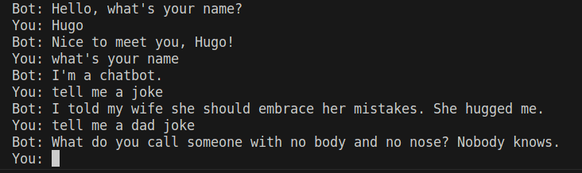
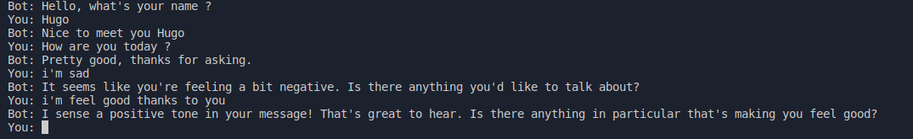
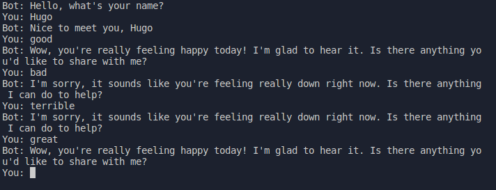
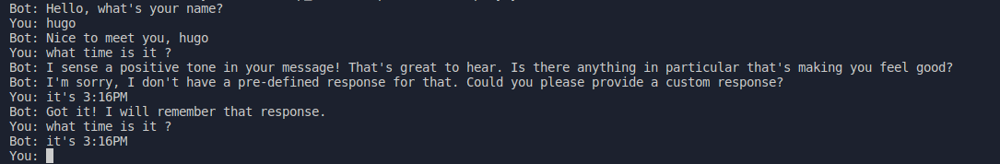
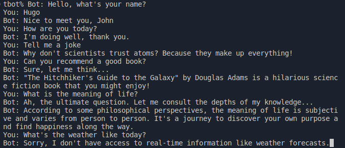

# **Workshop - Créer un chatbot en Python**

Durant ce Workshop, vous allez apprendre à créer un chatbot en utilisant des techniques de traitement de langage naturel et d'apprentissage automatique en Python. Vous commencerez par découvrir les bibliothèques Python de traitement de langage naturel, telles que NLTK et Spacy, pour comprendre comment les modèles de langage fonctionnent.

## **Comment cela va t-il se dérouler ?**

Vous utiliserez des techniques d'apprentissage automatique pour entraîner un modèle de traitement de langage naturel. Vous apprendrez comment collecter des données pour l'entraînement, comment nettoyer et prétraiter les données, et comment évaluer la qualité du modèle.

Par la suite vous utiliserez ensuite le modèle de traitement de langage naturel pour créer un chatbot en Python. Vous apprendrez comment configurer l'interface utilisateur du chatbot, comment traiter les entrées de l'utilisateur et comment générer des réponses appropriées en utilisant des outils de réponse dynamique.

Enfin, vous finirez par apprendre comment personnaliser vos chatbot en utilisant des techniques avancées de traitement de langage naturel. Vous pourrez utiliser des outils de génération de texte pour créer des réponses plus naturelles, et ils pourront entraîner le modèle de traitement de langage naturel sur des données spécifiques pour répondre à des questions uniques.

## **STEP 0: Installation**

Aujourd'hui, avant de commencer les exercices il vous faudra télécharger certaines choses pour pouvoir programmer vos bots...

## Installation de python3-pip :

Fedora : 
```
sudo dnf install python3-pip
```

Ubuntu :
```
sudo apt install python3-pip
```

## Installation des librairies avec pip :

```
pip install textblob
pip install spacy
python3 -m spacy download en_core_web_sm
```

## **Comment faire ?**
Vous trouverez chaque exercice dans les fichiers nommé (ex1/exercice1, ex2/exercice2...).

## **STEP 1: Un premier Chatbot avec des réponses prédéfinies**

La première étape de ce workshop est de créer un chatbot qui répondra à des questions prédéfinies comme "Bonjour", "Comment vas-tu ?" ou encore "Quel est ton nom ?".

Vous allez pour cela compléter le code qui vous a été fourni, n'hésitez pas à ajouter des questions et des réponses pour que votre bot soit plus complet ! Faites preuve d'imagination !



## **STEP 2: Un premier Chatbot en fonction de votre humeur**

Le but de l'exercice est de completer le code afin d'obtenir votre premier bot avec certaines réponses plutot simple, mais qui peuvent parfois dépendre en fonction de l'humeur avec laquelle vous parlerez au bot. Pour cela vous devrez comprendre à quoi correspond la variable 'polarity' et la manipuler pour pouvoir obtenir des réponses en fonction d'elle...



## **STEP 3: Un Chatbot en fonction de votre humeur, plus performant, grâce aux dictionnaires**

Le but de l'exercice est encore une fois de compléter le code grâce à l'exercice deux, en incorporant cette fois-ci un dictionnaire qui fera varier la variable 'polarity', ce qui permettra donc de faire changer l'humeur de vos réponses avec juste un mot défini dans le dictionnaire.



## **STEP 4: Un chatbot qui apprend en fonction de vos réponses**

Pour finir ce workshop vous aller programmer un bot en complétant une fois de plus le code fourni, qui apprendra de vos réponses s'il ne sait pas y répondre. Ce qui plus communément assimilé à du machine learning. À vous de jouer !



## **BONUS**
Merci d'avoir suivi ce Workshop vous avez maintenant de très bonnes bases pour faire votre propre Chatbot. Il faut savoir qu'il est également possible si vous possédez une clé API OpenAi de faire un chatbot sur la même base que ChatGPT, donc un très bon bot, vous avez donc un exercice bonus juste ici pour ceux qui possède une clé API OpenAI

